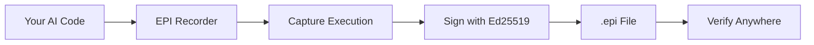

<div align="center">


# EPI Recorder

### Cryptographic Proof for AI Workflows

**Production-grade evidence infrastructure for autonomous AI systems**

[](https://pypi.org/project/epi-recorder/)
[](https://pypi.org/project/epi-recorder/)
[](LICENSE)
[](https://github.com/epilabs/epi-recorder/actions)

[Quick Start](#quick-start) • [Documentation](https://epilabs.org/docs) • [Examples](#examples) • [Community](https://github.com/epilabs/epi-recorder/discussions)

</div>

---

## Overview

**EPI Recorder** creates tamper-proof, cryptographically signed records of AI system behavior. Think of it as the "PDF for AI evidence"—standardized, verifiable, and portable proof of what your AI actually did.

### Key Features

- **🔐 Cryptographic Signatures** - Ed25519 signatures ensure mathematical proof of integrity
- **🔍 Complete Transparency** - Captures full execution context, API calls, and decisions
- **🛡️ Automatic Redaction** - Sensitive data masked before recording
- **📦 Self-Contained** - Single `.epi` file contains everything needed for verification
- **🌐 Offline Verification** - Client-side verification works air-gapped
- **⚡ Zero-Config Setup** - Works with OpenAI, Gemini, and any Python code

---

## Quick Start

### Installation

```bash
pip install epi-recorder
```

### Basic Usage

**CLI - Record any Python script:**

```bash
epi run your_script.py
```

**Python API - Decorate your functions:**

```python
from epi_recorder import record

@record
def trading_decision(market_data):
    # Your AI logic here
    return decision

# Automatically creates cryptographically signed evidence
```

**View Evidence:**

```bash
epi view evidence.epi  # Opens interactive viewer
```

---

## Use Cases

### Financial Services
Regulatory compliance for algorithmic trading, loan decisions, and risk assessments. Create audit trails that satisfy regulatory requirements.

### Healthcare
Document AI-assisted diagnostics and treatment recommendations with cryptographic proof for medical records and liability protection.

### Legal & Compliance
Verifiable evidence for AI-driven legal research, contract analysis, and compliance decisions.

### Research & Development
Reproducible AI experiments with complete execution snapshots for peer review and verification.

---

## How It Works



1. **Capture** - Records API calls, responses, and execution context
2. **Redact** - Automatically masks sensitive data (API keys, PII)
3. **Sign** - Cryptographically signs with Ed25519
4. **Package** - Creates self-contained `.epi` file
5. **Verify** - Offline verification in browser or CLI

---

## Examples

### Record LLM API Calls

```python
from epi_recorder import EpiRecorderSession
import openai

with EpiRecorderSession("financial_analysis"):
    response = openai.ChatCompletion.create(
        model="gpt-4",
        messages=[{"role": "user", "content": "Analyze this portfolio"}]
    )
    # Automatically recorded and signed
```

### Verify Evidence

```python
from epi_core import verify_integrity

result = verify_integrity("evidence.epi", public_key_path="key.pub")
print(f"Valid: {result.valid}")
print(f"Signer: {result.signer}")
```

More examples in [`examples/`](./examples) directory.

---

## Architecture

EPI Recorder consists of three main components:

- **`epi_core`** - Cryptographic signing, verification, and serialization
- **`epi_recorder`** - API interception and workflow capture
- **`epi_cli`** - Command-line interface and tooling

See [ARCHITECTURE.md](./docs/ARCHITECTURE.md) for details.

---

## Security

### Cryptographic Details

- **Signature Algorithm**: Ed25519 (RFC 8032)
- **Hash Function**: SHA-256
- **Serialization**: Canonical CBOR (RFC 8949)
- **Library**: Python `cryptography` (industry standard)

### Security Considerations

- Private keys stored with 600 permissions in `~/.epi/keys/`
- Automatic secret redaction with configurable patterns
- Client-side verification eliminates trust requirements
- No external API calls for verification

See [SECURITY.md](./SECURITY.md) for vulnerability reporting.

---

## Documentation

- **[Installation Guide](https://epilabs.org/docs/installation)** - Detailed setup instructions
- **[API Reference](https://epilabs.org/docs/api)** - Complete API documentation
- **[CLI Reference](https://epilabs.org/docs/cli)** - Command-line usage
- **[Architecture](./docs/ARCHITECTURE.md)** - System design and internals
- **[FAQ](https://epilabs.org/docs/faq)** - Frequently asked questions

---

## Contributing

We welcome contributions! Please see [CONTRIBUTING.md](./CONTRIBUTING.md) for guidelines.

### Development Setup

```bash
git clone https://github.com/epilabs/epi-recorder
cd epi-recorder
pip install -e ".[dev]"
pytest
```

---

## Community

- **[GitHub Discussions](https://github.com/epilabs/epi-recorder/discussions)** - Ask questions, share ideas
- **[Issue Tracker](https://github.com/epilabs/epi-recorder/issues)** - Report bugs, request features
- **[Changelog](./CHANGELOG.md)** - Release history
- **Email**: mohdibrahim@epilabs.org

---

## License

Apache 2.0 - See [LICENSE](./LICENSE) for details.

---

## About EPI Labs

EPI Labs builds verification infrastructure for AI systems. Our mission is to make AI trustworthy through cryptographic proof, not promises.

**Website**: [epilabs.org](https://epilabs.org)  
**GitHub**: [@epilabs](https://github.com/epilabs)

---

<div align="center">

**Trust through verification, not promises.**

</div>
